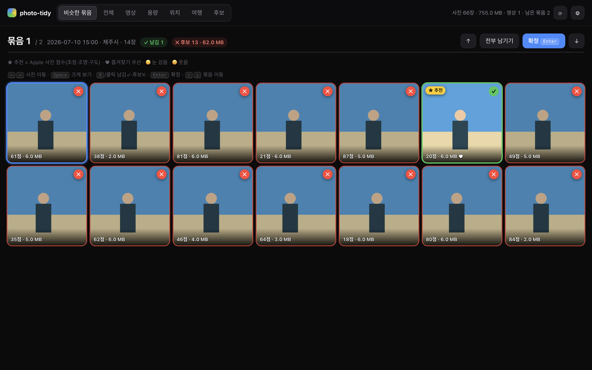
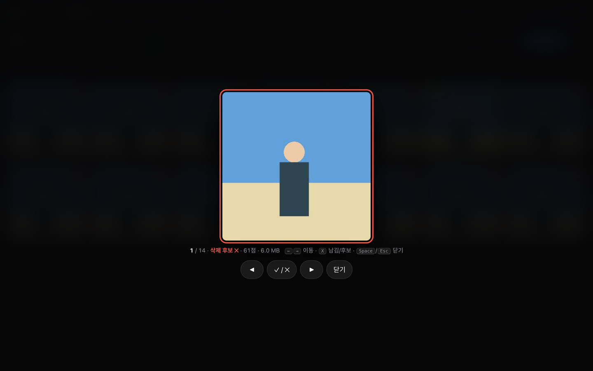
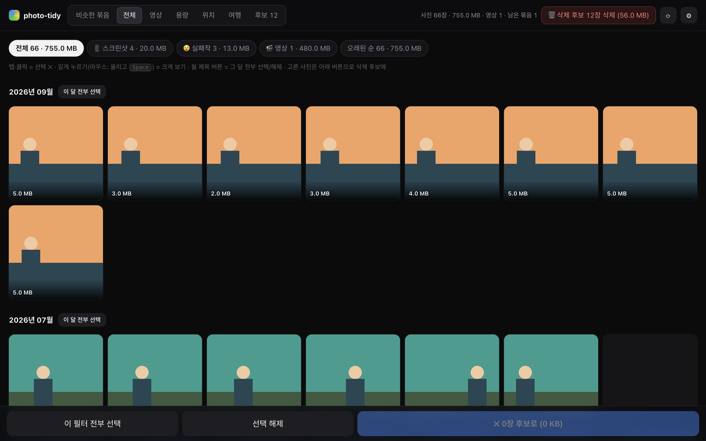
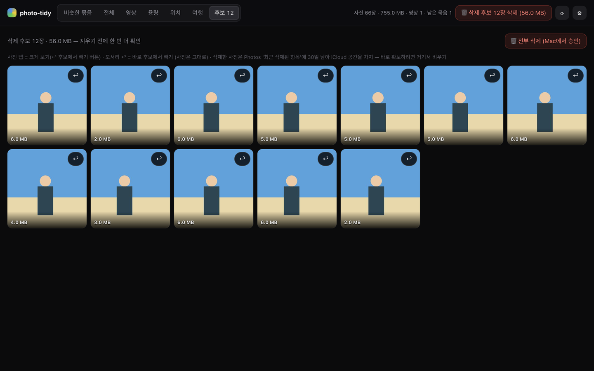
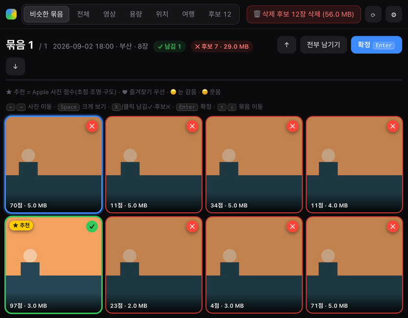
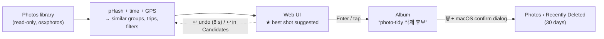
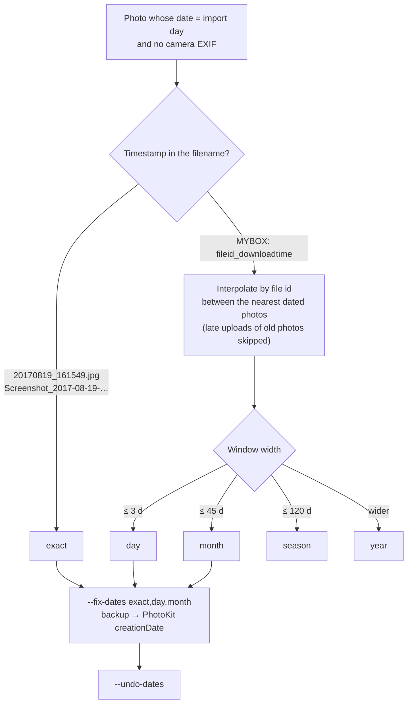

# photo-tidy

Tidy your **iCloud / Mac Photos** library from a local web UI — on your Mac, or from a tablet/phone.

> 한국어 요약: Mac 사진 앱(= iCloud 사진 = iPhone 갤러리) 라이브러리를 로컬 웹 화면에서 정리하는 도구.
> 같은 장소에서 연달아 찍은 비슷한 사진 묶음에서 베스트만 남기고, 스크린샷·실패작·큰 영상을 골라내고, 삭제 후보를 모아 한 번에 지웁니다.
> 화면(UI)은 한국어입니다.

## What it does

| Tab | |
|---|---|
| **Similar groups** | Shots taken in a row at the same spot (≤5 min, ≤100 m, perceptually similar) are grouped; the best one is suggested (★), the rest are marked as delete candidates. One key/tap confirms the whole group. |
| **All** | The whole library by month. Filters: 📱 screenshots · 😵 failed shots (Apple's on-device "failure" score) · 💥 burst leftovers · 🎬 videos · oldest. Select by tap, by month, or the whole filter. |
| **Videos** | Largest first, with duration and the storyboard frames Photos keeps locally — see what a video is without downloading it. Favorites are marked ♥. |
| **Size / Places / Trips** | Biggest items, country › city, and trips detected automatically (consecutive days ≥50 km from every "home"). |
| **Candidates** | Everything you marked, to review once more before deleting; remove items with ↩. |

Nothing is deleted until you press 🗑 and approve the **macOS confirmation dialog**. Deleted items stay in Photos › *Recently Deleted* for 30 days — and keep using iCloud storage until you empty it there.

Everything runs **locally** on your Mac. No photos or metadata are uploaded anywhere.

## Screenshots

Captured from the synthetic demo library (`uv run python tests/demo.py`), so no real photos appear.

| Similar groups — ★ best shot suggested, the rest marked ✕ | Large preview (`Space` / long-press) |
|---|---|
|  |  |

| All — filters, by month, select a whole month | Candidates — one more look, ↩ to restore, 🗑 to delete |
|---|---|
|  |  |

Culling one group: `→` `→` `X` keeps a second shot, `Space` checks it large, `Enter` confirms — the 12 rejected photos land in the candidates album and the next group opens.


<p align="center"></p>

### How a photo travels



## Requirements

- macOS with the Photos app (iCloud Photos optional — "Optimize Mac Storage" is supported)
- [uv](https://docs.astral.sh/uv/) and Python 3.12
- Xcode or Command Line Tools (`swiftc`) — a small PhotoKit helper app is compiled on first run

## Install

```bash
uv tool install git+https://github.com/gil-pingping/photo-tidy
photo-tidy            # opens http://localhost:8765
```

The first run computes perceptual hashes of your thumbnails (≈1 min per 20k photos); later runs use the cache.

## Permissions (once)

| Permission | Why | Where |
|---|---|---|
| **Full Disk Access** for your terminal app | read the Photos library database (read-only) | System Settings › Privacy & Security › Full Disk Access |
| **Photos** for the `photo-tidy` helper | high-res previews, album add/remove, deleting | prompted the first time the helper runs |
| **Automation › Photos** (fallback only) | album add via AppleScript if the helper is unavailable | prompted when needed |

If you have an *Apple Development* signing certificate, the helper is signed with it so the Photos permission survives rebuilds; otherwise it is ad-hoc signed (you may be asked again after an update).

## Usage

```bash
photo-tidy                     # local only: http://localhost:8765
photo-tidy --tailscale         # also from your own Tailscale devices (tablet/phone): http://<your-mac>:8765
photo-tidy --library ~/Pictures/Other.photoslibrary
photo-tidy --install-autostart # start automatically at login (see below)
```

`--tailscale` accepts connections only from this Mac and your Tailscale network (100.64.0.0/10); other devices on the same Wi-Fi get 403. While serving remotely, the Mac is kept awake (`caffeinate`).

**Keyboard (groups)**: `←/→` move · `Space` large preview · `X`/click keep ✓ ↔ candidate ✕ · `Enter` confirm · `↑/↓` previous/next group. Other tabs: hover + `Space`.

**Touch**: tap = select/toggle · long-press = large preview (tap the photo to toggle, swipe to move) · swipe the group screen = previous/next group · bottom bar for confirm / send.

After confirming a group, **↩ Undo** appears for 8 seconds. **⟳** re-reads the Photos library. **⚙️** tunes the grouping/trip parameters live.

### Start at login

```bash
photo-tidy --install-autostart     # builds a tiny "photo-tidy server" app + a LaunchAgent (runs with --tailscale)
photo-tidy --uninstall-autostart
```

macOS ties Full Disk Access to the app that starts the server, so after installing, add **photo-tidy server** (in `~/.photo_tidy/`) to *Full Disk Access* once. Logs: `~/.photo_tidy/server.log` (reset above 5 MB).

If the server exits (crash, Tailscale not up yet, port busy), the launcher restarts it after 30 s. To run new code after `uv tool install --force --reinstall …`, just `pkill -f bin/photo-tidy` — or re-run `--install-autostart`.

### Recover capture dates (cloud downloads)

Photos downloaded from a cloud service (e.g. Naver MYBOX) often arrive without EXIF, so Photos shows the download day for all of them.

```bash
photo-tidy --fix-dates                   # report only: how many photos lost their date, and how precisely each can be recovered
photo-tidy --fix-dates exact,day,month   # apply those tiers (originals backed up to ~/.photo_tidy/dates-backup.json)
photo-tidy --undo-dates                  # restore the original dates
```

```text
$ photo-tidy --fix-dates
Photos 라이브러리 읽는 중…
날짜가 '가져온 날'로 된 사진 3374장 — 복원 가능 3331장, 단서 없음 43장 (저장·받은 이미지 등)
  exact       54장
  day        949장
  month     2301장
  season      48장
  year         6장
→ 사진별 계획: ~/.photo_tidy/dates-plan.csv
```



How dates are recovered: a timestamp in the filename (`20170819_161549.jpg`, `Screenshot_2017-08-19-…`) is taken as is (**exact**); MYBOX filenames `<file-id>_<download-time>` carry an upload-ordered id, so a photo is placed between the nearest dated photos by id (tiers **day/month/season/year** by the width of that window; late uploads of old photos are skipped as anchors). On a 3,374-photo download this put 90% within a day and 92% within a month under a strict hold-out test. Hidden photos cannot be changed (PhotoKit); the per-photo plan is written to `~/.photo_tidy/dates-plan.csv`.

## How it works

- Reads the Photos database read-only with [osxphotos](https://github.com/RhetTbull/osxphotos); hashes the local thumbnails with [imagehash](https://github.com/JohannesBuchner/imagehash) (no originals downloaded).
- **Best shot**: favorites first; in groups with faces, 65% face score (quality, eyes open, smile — from Photos' on-device analysis) + 35% Apple's aesthetic score; otherwise the aesthetic score alone.
- **High-res preview**: with "Optimize Mac Storage" only ~480 px thumbnails are local, so a resident PhotoKit helper fetches 1600 px previews from iCloud for the current group and the next ~300 photos. Previews of reviewed groups are evicted.
- **Videos**: storyboard frames first; ▶ fetches the original from iCloud and converts it to a 540p MP4 for any browser.
- Album changes and deletion go through PhotoKit (AppleScript adds ~500 photos per 75 s and can't remove from an album or delete).

## Tuning (⚙️ or `photo_tidy/analyze.py` → `Params`)

| Parameter | Default | Meaning |
|---|---|---|
| `hash_max` | 22 | max Hamming distance of the 64-bit pHash between consecutive shots (≤22 ≈ same scene) |
| `gap_min` | 5 | max minutes between consecutive shots |
| `near_m` | 100 | max meters between shots (only when both have GPS) |
| `min_group` | 3 | minimum photos per group |
| `trip_km` / `min_trip` | 50 / 5 | trip distance from every home / minimum photos |
| `home_days` | 30 | an area photographed on this many different days counts as a home |

## Known limitations

- iCloud downloads go through Apple's photo daemon, which effectively processes them one at a time: ~1–3 s per photo preview, and **minutes** for a 4K video original.
- Photos doesn't keep storyboard frames for every video (often not for the very largest ones).
- The macOS delete confirmation appears on the Mac's screen, even when you work from a tablet.
- Undo is available only for groups confirmed since the server started.
- macOS only.

## Data

All state lives in `~/.photo_tidy/` (hash cache, reviewed photos, settings, stats, preview/video caches, helper apps and logs). Delete the folder to start over — your Photos library is never modified except for the candidates album and deletions you approve.

## Development

```bash
uv run pytest -q              # unit + HTTP tests (no Photos access needed)
uv run python tests/demo.py   # synthetic library UI at http://localhost:8799
```

Structure: `library.py` (Photos access, hashing, PhotoKit helper) → `analyze.py` (grouping, best shot, trips, places — pure functions) → `dates.py` (capture-date recovery) → `server.py` (stdlib HTTP API + CLI) → `autostart.py` (login item) → `static/index.html` (vanilla JS). Tabs are deep-linkable: `http://localhost:8765/#videos`.

## License

MIT
